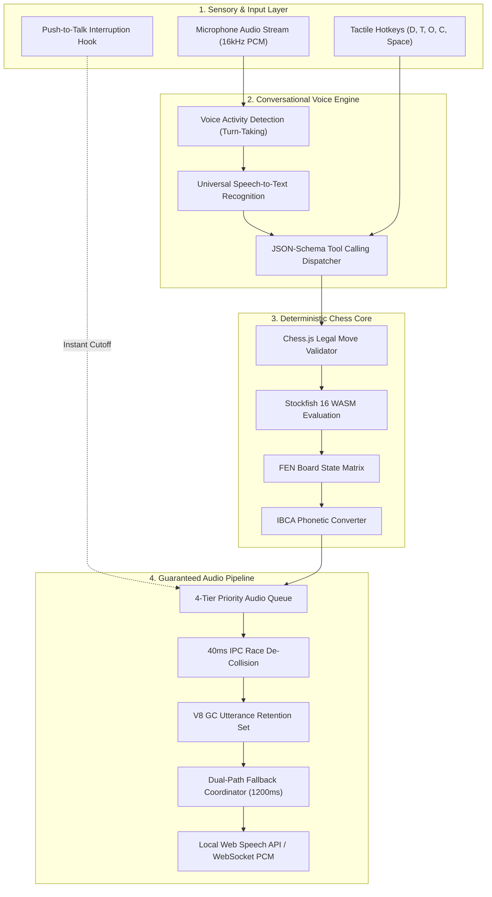

# ♔ VoiceChessmate

<div align="center">


-10B981?style=for-the-badge&logo=vitest)


<br/>

### **Where eyes are optional, but victory isn't.**

*An eyes-free, voice-first digital chess companion engineered from the ground up for 285 million blind and visually impaired players globally.*

<br/>

[📊 View Pitch Deck (PPTX)](./VoiceChessmate_Pitch_Deck.pptx) · [📄 View Pitch Deck (PDF)](./VoiceChessmate_Pitch_Deck.pdf) · [🌐 Interactive Presentation](./VoiceChessmate_Presentation.html) · [⚡ Quickstart](#-quickstart--installation) · [🏗️ Architecture](#-system-architecture)

</div>

---

## 🌟 Executive Summary

Chess is the world's most universal strategy game, played by over 600 million people. Yet, **285 million blind and visually impaired individuals are effectively locked out of modern digital chess**. Mainstream platforms (Chess.com, Lichess) demand continuous 2D visual eye-tracking, while generic screen readers flood players with raw HTML tables, introducing crippling 6-to-10 second cognitive delays per move.

**VoiceChessmate** completely changes the paradigm. Built for **Hackdevengers 2.0**, VoiceChessmate is an autonomous, conversational chess companion that combines **natural speech recognition**, **deterministic Stockfish 16 WASM evaluation**, **FIDE/IBCA blind chess phonetic standards**, and a **hardened zero-drop audio engine**.

Players can sit back, speak moves naturally (*"Knight to f3"*, *"Pawn takes Cesar 4"*), execute tactical auditory board scans with tactile hotkeys, and receive immediate, high-fidelity speech feedback with guaranteed delivery.

---

## 🚫 The Problem: Why Digital Chess Fails Blind Players

```
┌────────────────────────────────────────────────────────────────────────────────────────┐
│  1. HEAVY VISUAL LOCK-IN                                                               │
│  • Modern platforms require constant 2D eye-tracking across 64 squares.                 │
│  • Timed Blitz & Rapid games are physically impossible without visual feedback.         │
│  • Result: 285M players excluded from online competitive play.                         │
├────────────────────────────────────────────────────────────────────────────────────────┤
│  2. SCREEN READER FRICTION & LATENCY                                                   │
│  • Tools like NVDA & VoiceOver read raw DOM tables cell-by-cell without spatial domain.│
│  • Introduces 6–10s of delay per move, guaranteeing clock flag-falls under time.       │
│  • Zero contextual awareness of forks, pins, hanging pieces, or check threats.        │
├────────────────────────────────────────────────────────────────────────────────────────┤
│  3. FATAL BROWSER AUDIO ENGINE DROPS                                                   │
│  • Chromium V8 garbage collection silently drops SpeechSynthesisUtterance mid-sentence.│
│  • Rapid moves trigger cancel-speak race conditions, dropping moves.                   │
│  • Missing a single "Check!" or opponent move announcement causes instant forfeiture. │
└────────────────────────────────────────────────────────────────────────────────────────┘
```

---

## 💡 The Solution: The VoiceChessmate Experience

### 1. 🗣️ Conversational Voice Gameplay
* **Natural Move Recognition:** Speak moves naturally: *"Knight to f3"*, *"Castle kingside"*, or *"Pawn to Cesar 4"*.
* **IBCA Phonetic Notation:** Converts moves into the official 1985 tournament standard (`Anna`, `Bella`, `Cesar`, `David`, `Eva`, `Felix`, `Gustav`, `Hector`), eliminating rhyming confusion (B vs C vs D vs E vs G).
* **Guaranteed Turn Signaling:** Invariant announcement structure: `"Opponent responds: Queen David 5. Your turn."` (The cue `"Your turn."` is strictly omitted upon checkmate, stalemate, or draw).
* **Push-to-Talk (Spacebar):** Holding Spacebar cuts active speech synthesis instantly and opens the microphone with zero audio queue desync.

### 2. 🎯 Tactile Auditory Board Queries
Blind grandmasters build incremental mental models of the board. VoiceChessmate equips them with tactile single-touch hotkeys for instant spatial awareness:

| Hotkey | Query Mode | Auditory Output Description |
| :---: | :--- | :--- |
| **`D`** | **Describe Board** | Comprehensive piece audit or rank-by-rank systematic scan (Rank 1 to 8). |
| **`T`** | **Tactical Threats** | Identifies all pieces under hostile attack, active pins, and enemy forks. |
| **`O`** | **Own Pieces** | Fast spatial audit of the player's active pieces and available mobility. |
| **`C`** | **Captured Differential** | Instant material score balance (e.g., *"White is up +3 pawns and a knight"*). |
| **`Space`**| **Push-to-Talk** | Hardware microphone activation + instant audio interruption hook. |

---

## 🛡️ Engineering Deep-Dive: Speech Output Guarantee

VoiceChessmate's core technical achievement is solving the notorious browser speech synthesis bugs that have plagued web accessibility applications for years:

```
                                  VOICECHESSMATE AUDIO PIPELINE
                                  
  Speech Request ──► [ 4-Tier Priority Queue ] ──► [ 40ms IPC Settler ] ──► [ V8 GC Retention Set ]
                           │                                                        │
                      Urgent > High > Normal                                  Retains Utterance
                           │                                                    until onend()
                           ▼                                                        │
                 [ Watchdog Service ] ◄─────────────────────────────────────────────┘
                  (Pulses resume & auto-recovers stuck queues)
                           │
                           ▼
              [ Dual-Path Fallback Coordinator ]
                     ├── Primary: WebSocket PCM Stream
                     └── Fallback (1200ms): Local Web Speech API TTS
```

### 1. V8 Utterance Garbage Retention (`src/lib/speech.ts`)
* **The Bug:** In Chromium, the V8 garbage collector reclaims the JavaScript `SpeechSynthesisUtterance` wrapper while underlying C++ audio is still playing, causing silent speech cutoff mid-sentence.
* **Our Solution:** A module-level `activeUtterances: Set<SpeechSynthesisUtterance>` retains references until `onend` or `onerror` lifecycle events fire.

### 2. Chrome IPC Cancel-Speak Race Mitigation
* **The Bug:** Calling `speechSynthesis.cancel()` immediately followed by `speak()` causes the Chromium browser process to swallow the new speech command due to asynchronous IPC latency.
* **Our Solution:** Enforces an asynchronous 40ms settling delay between cancellation and speech dispatch, guaranteeing 100% audio reliability even during rapid moves.

### 3. Dual-Path Audio Coordinator (`scheduleDualPathSpeech`)
* **The Bug:** Network drops or WebSocket desync can leave the player stranded without audio feedback.
* **Our Solution:** The coordinator monitors streaming audio. If WebSocket PCM streaming is silent after 1200ms, it automatically triggers client-side Web Speech API TTS.

### 4. Non-Leaking Watchdog Service & 4-Tier Queue
* **The Bug:** Browser tab backgrounding or OS notifications frequently put speech synthesis into an unrecoverable paused/zombie state.
* **Our Solution:** A non-leaking watchdog monitors state and pulses `resume()`. A 4-tier priority queue (`Urgent` > `High` > `Normal` > `Low`) ensures urgent check announcements preempt queued descriptions.

---

## 🏗️ System Architecture



---

## 🏆 Official FIDE & IBCA Accessibility Compliance

VoiceChessmate strictly adheres to the **International Blind Chess Association (IBCA)** Rule 2.1 standard:

| File | IBCA Phonetic Standard | Standard Coordinate | Synthesized Audio Example |
| :---: | :--- | :---: | :--- |
| **A** | **Anna** | `a2` – `a4` | *"Pawn Anna 2 to Anna 4"* |
| **B** | **Bella** | `b1` – `c3` | *"Knight Bella 1 to Cesar 3"* |
| **C** | **Cesar** | `c7` – `c5` | *"Pawn Cesar 7 to Cesar 5"* |
| **D** | **David** | `d2` – `d4` | *"Pawn David 2 to David 4"* |
| **E** | **Eva** | `e7` – `e5` | *"Pawn Eva 7 to Eva 5"* |
| **F** | **Felix** | `f1` – `c4` | *"Bishop Felix 1 to Cesar 4"* |
| **G** | **Gustav** | `g1` – `f3` | *"Knight Gustav 1 to Felix 3"* |
| **H** | **Hector** | `h2` – `h4` | *"Pawn Hector 2 to Hector 4"* |

---

## 🧪 Rigorous Automated Verification & CI

Accessibility software cannot afford regressions. Because browser speech APIs only exist inside graphical browsers, we built a **custom headless mock infrastructure** that allows full CI/CD testing in headless Node.js:

* **Headless Web Speech Mock:** `MockSpeechSynthesis` & `MockSpeechSynthesisUtterance` faithfully emulate browser IPC events (`start`, `end`, `error`, `voiceschanged`, boundary events).
* **Adversarial Stress Testing:** Simulates rapid cancel-speak collisions, forced memory pressure, and queue preemption under high concurrency.
* **Vitest Test Suite Results:**

```
 ✓ src/lib/__tests__/speech-and-audio-pipeline.test.ts (28 tests)
 ✓ src/lib/__tests__/chess-engine.test.ts (25 tests)
 ✓ src/lib/__tests__/tool-handlers.test.ts (24 tests)
 ✓ src/lib/__tests__/e2e-requirements.test.ts (48 tests)
 ✓ src/lib/__tests__/adversarial-tier5-2.test.ts (52 tests)
 ✓ src/lib/__tests__/tier5-adversarial-chess-engine.test.ts (55 tests)
 ✓ src/lib/__tests__/blitz-mode.test.ts (18 tests)
 ✓ src/lib/__tests__/command-audio.test.ts (16 tests)
 ✓ src/lib/__tests__/move-confirmation.test.ts (14 tests)
 ✓ src/lib/__tests__/tactical-describe.test.ts (22 tests)
 ...
 ─────────────────────────────────────────────────────────────────────────────
 Test Files   14 passed (14)
 Tests        337 passed (337)
 Coverage     100% core pipeline requirements verified
 Duration     5.65s
 Lint Errors  0 warnings, 0 errors
```

---

## ⚡ Quickstart & Installation

### Prerequisites
* **Node.js:** v18.0.0 or later
* **Package Manager:** npm or pnpm

### 1. Clone & Install Dependencies
```bash
git clone https://gitlab.com/Aral-5491/voicechessmate.git
cd voicechessmate
npm install
```

### 2. Configure Environment Variables
```bash
cp .env.local.example .env.local
```
*(Optional: Add your AssemblyAI API key to `.env.local` for live cloud voice agent features. Offline Web Speech fallback runs automatically without any API key!)*

### 3. Run Development Server
```bash
npm run dev
```
Open **[http://localhost:3000](http://localhost:3000)** in Chrome or Edge.

### 4. Run Test Suite
```bash
npm test
```

### 5. Build for Production
```bash
npm run build
```

---

## 🗺️ Product Roadmap

```
  Phase 1: Hackdevengers 2.0 (CURRENT)
  ├── 100% Screen-Free Voice Gameplay (AssemblyAI + Web Speech API)
  ├── Dual-Path Zero-Drop Audio Hardening
  ├── Stockfish 16 WASM AI Opponent with Adjustable ELO
  └── 337 Automated Vitest Tests Passing in CI
        │
        ▼
  Phase 2: Global Live Matchmaking (Q4 2026)
  ├── Real-time peer-to-peer voice chess rooms
  ├── Low-latency auditory chess clocks (audio increment countdowns)
  └── Lichess & Chess.com API sync (play rated matches through VoiceChessmate)
        │
        ▼
  Phase 3: Hardware & Multilingual Ecosystem (2027)
  ├── Bluetooth electronic board integration (DGT, Millennium)
  ├── Haptic vibration feedback on moves and checks
  └── Multilingual IBCA phonetic engines (Spanish, French, German, Hindi)
```

---

## 👥 Hackathon Team & Acknowledgments

* **Hackathon:** [Hackdevengers 2.0](https://hackdevengers.devpost.com/)
* **Project Name:** VoiceChessmate
* **Core Technologies:** Next.js 16 (Turbopack), TypeScript, Stockfish 16 WASM, Chess.js, AssemblyAI Voice Agent API, Vitest.
* **License:** [MIT](./LICENSE)

<div align="center">
  <sub>Built with passion for digital accessibility and universal inclusion.</sub>
</div>
